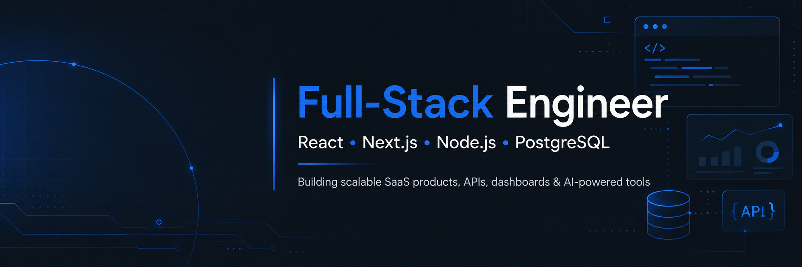

## 👨‍💻 About Me

I'm a full-stack engineer with hands-on experience delivering complete product systems for real clients — from frontend interfaces to backend APIs, authentication, relational databases, dashboards, and deployment.

I have delivered SaaS products, enterprise tools, e-commerce platforms, and AI-powered applications using modern JavaScript technologies.

- 🚀 Top Rated on Upwork with 100% Job Success Score
- 🏢 Built an enterprise job tracking system serving 60+ users
- 🧩 Delivered production SaaS platforms, dashboards, APIs, and full-stack web apps
- 🤖 Experienced with OpenAI API, Google Gemini API, and AI-assisted development workflows
- 🎯 Focused on clean architecture, scalable systems, and practical product delivery

---

## 🛠️ Tech Stack

### Frontend

### Backend

### Databases & ORM

### Tools & Deployment

### AI

---

## 📊 GitHub Statistics

---

## 🤝 Let's Connect

I'm currently open to full-stack engineering opportunities where I can build real products, work with strong teams, and contribute across frontend, backend, databases, and AI-powered features.

